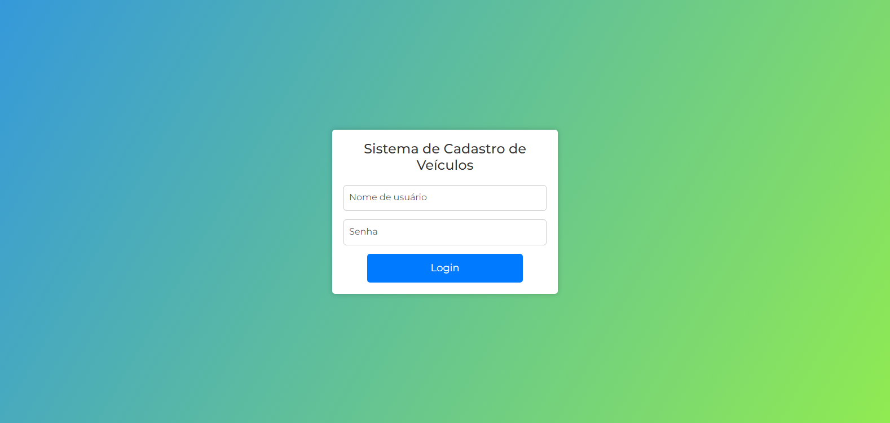
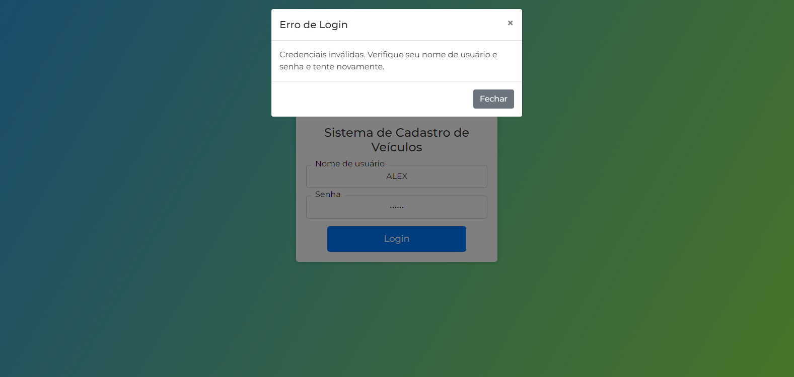
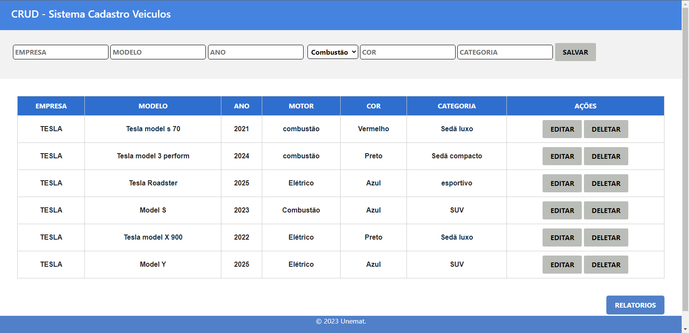
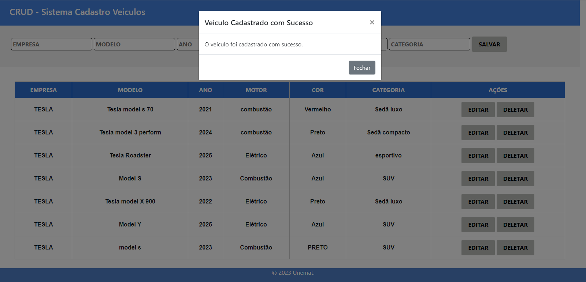
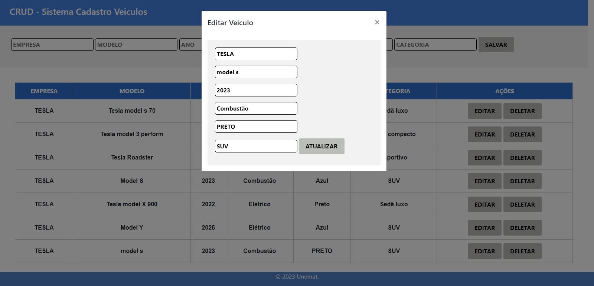
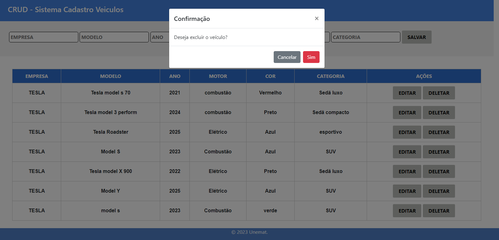
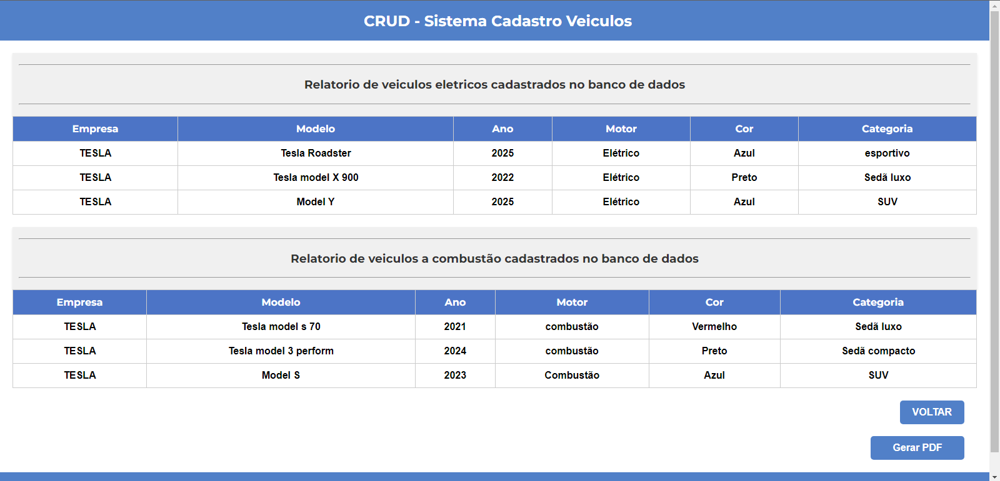
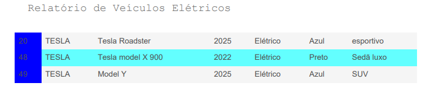
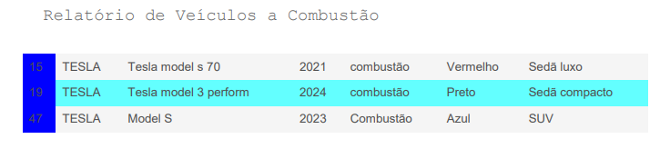

# Sistema de Cadastro de Veículos Eletricos e Combustão
Este é um sistema de cadastro de veículos Eletricos e Combustão desenvolvido em HTML, CSS e JavaScript e utiliza o framework Bootstrap para estilização, o sistema oferece funcionalidades básicas de um CRUD para gerenciar informações de veículos, permitindo a adição, edição, exclusão e visualização dos dados.

# Imagens de Demonstração
<p float="left">
    
    
    
    
    
    
    
    
    
    
</p>

# Funcionalidades
- Cadastro de Veículos: Permite adicionar novos veículos ao sistema, incluindo informações como empresa, modelo, ano, motor, cor e categoria.
- Edição de Veículos: Possibilita a edição dos dados de veículos já cadastrados.
- Exclusão de Veículos: Permite a exclusão de veículos do sistema.
- Relatórios: Oferece a geração de relatórios, separados por veículos elétricos e veículos a combustão.
    - Gera também um relatorio em PDF

# Instalações
Antes de rodar a API, certifique-se de ter o Node.js e o npm instalados em seu sistema.

Você pode baixá-los em https://nodejs.org/

Para instalar as dependências do projeto, utilize o seguinte comando:

   ```bash
   npm install
   ```
# Banco de Dados
Este projeto utiliza um banco de dados chamado `sistema` com duas tabelas principais: `usuarios` e `veiculos` não relacionadas entre si.
  
# Configuração do Banco de Dados
Certifique-se de ter um servidor MySQL em execução e crie um banco de dados para a aplicação, Atualize as configurações de conexão no arquivo `mysql/conexao.js` conforme
necessário.

```javascript
const connection = mysql.createConnection({
    host: 'seu-host',
    user: 'seu-usuario',
    password: 'sua-senha',
    database: 'sistema'
});
```

# Rodando a API
Existem duas maneiras de iniciar a API: modo de produção e modo de desenvolvimento.

- Modo de Produção: Execute o seguinte comando **'npm start'**

- Modo desenvolvimento: Execute o seguinte comando **'npm run dev'**
  
Modo de Desenvolvimento é recomendável usar o Nodemon para reiniciar automaticamente
o servidor sempre que houver alterações no código.

O servidor estará acessível em http://localhost:3000 por padrão depois de iniciado.


# Dependências
A API utiliza as seguintes dependências:

- **Bootstrap**: Framework CSS para estilização.
- **jQuery**: Biblioteca JavaScript para manipulação de eventos e requisições AJAX.
- **bcrypt**: Método de criptografia de hash para senhas de acesso.
- **ejs**: Mecanismo de template para JavaScript.
- **Express**: Framework web para Node.js.
- **express-session**: Middleware para gerenciamento de sessão no Express.
- **jspdf**: Biblioteca JavaScript para geração de PDF no navegador.
- **mysql**: Driver para Node.js para comunicação com bancos de dados MySQL.
  
Certifique-se de ter todas essas dependências instaladas e configuradas corretamente.

# Contribuições
Sinta-se à vontade para utilizar, modificar e contribuir para aprimorar este código, sinta-se à vontade para enviar um pull request. Fico feliz com sugestões e melhorias!

# 👨‍💻 Desenvolvedor
Este projeto foi desenvolvido por Alex Pablo de Oliveira Moraes.

Sou estudante de Sistemas de Informação na UNEMAT, apaixonado por tecnologia, programação e segurança de redes e tecnologias relacionadas ao desenvolvimento backend e segurança da informação.

Você pode me encontrar nas redes sociais ou conferir meus outros projetos no meu perfil GitHub.

Se tiver alguma dúvida ou sugestão sobre o projeto, fique à vontade para entrar em contato!
